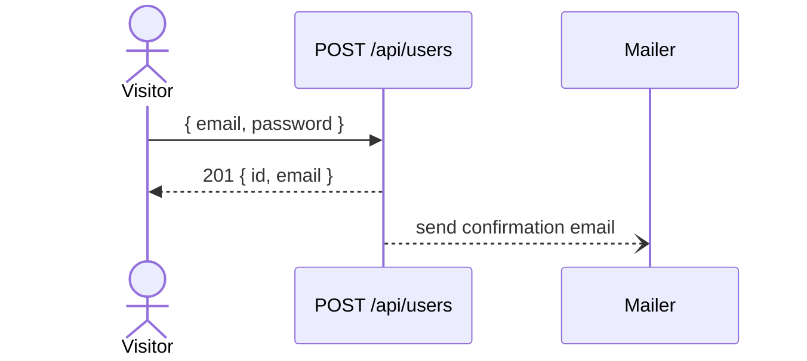

## User story

> **As a** visitor, **I want** to create an account with my email and password,
> **so that** I can access the application.

## Diagram

## Technical description

- Creates a `User` entity with a hashed password.
- Sends a confirmation email via the mailer service.
- Returns 409 if the email is already registered.
- Returns 422 if the payload is invalid (missing field, invalid email format).

## Acceptance Criteria

### Scenario: Successful registration

* **Given** no account exists with email `alice@example.com`
* **When** `POST /api/users` is sent with `{"email":"alice@example.com","password":"s3cr3t"}`
* **Then** the response status is 201
* **And** the response body contains `id` and `email`

### Scenario: Duplicate email is rejected

* **Given** an account with email `alice@example.com` already exists
* **When** `POST /api/users` is sent with the same email
* **Then** the response status is 409

### Scenario: Invalid payload is rejected

* **When** `POST /api/users` is sent without an email field
* **Then** the response status is 422
