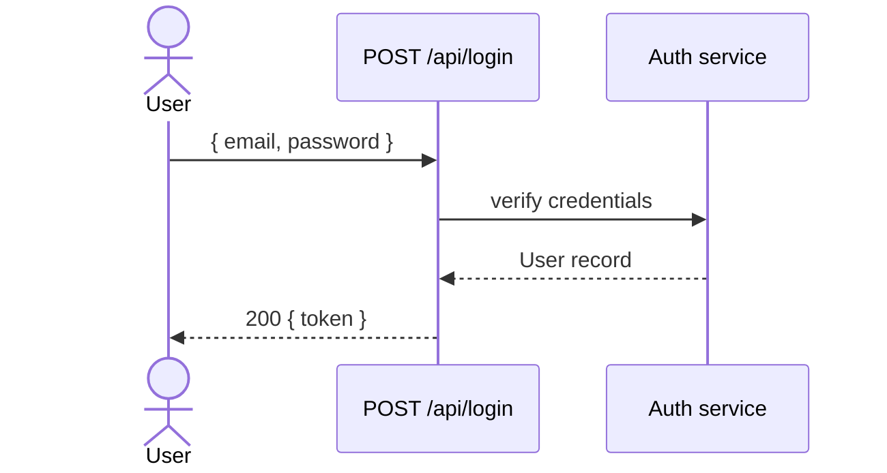

## User story

> **As a** registered user, **I want** to log in with my email and password,
> **so that** I can access my account.

## Diagram

## Technical description

- Verifies credentials against the stored hashed password.
- Returns a signed JWT token on success.
- Returns 401 on wrong password or unknown email (same message — no user enumeration).

## Acceptance Criteria

### Scenario: Successful login

* **Given** a user with email `alice@example.com` and password `s3cr3t` exists
* **When** `POST /api/login` is sent with `{"email":"alice@example.com","password":"s3cr3t"}`
* **Then** the response status is 200
* **And** the response body contains a non-empty `token` field

### Scenario: Wrong password

* **Given** a user with email `alice@example.com` exists
* **When** `POST /api/login` is sent with password `wrong`
* **Then** the response status is 401

### Scenario: Unknown email

* **When** `POST /api/login` is sent with email `nobody@example.com`
* **Then** the response status is 401
