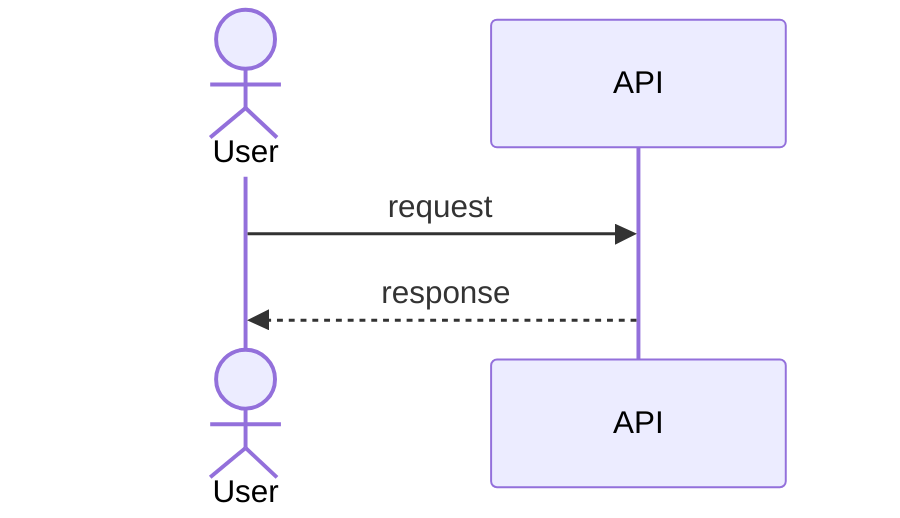

## User story

> **As a** `<role>`, **I want** `<need>`, **so that** `<business value>`.

## Diagram

## Technical description

- Layers affected:
- Files / classes touched:
- Architecture constraints:

## Acceptance Criteria

### Scenario: Happy path

* **Given** <context>
* **When** <action>
* **Then** <expected result>

### Scenario: Error case

* **Given** <context>
* **When** <action>
* **Then** <expected error>

## Notes

<!-- Deferred decisions, alternatives considered, cross-references to other stories -->
